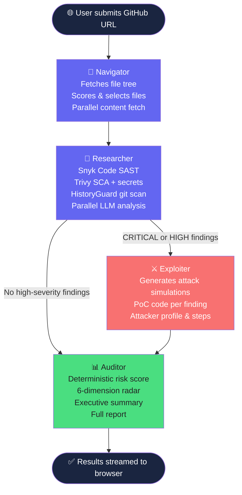

# SwiftAudit

**Pentester-grade, multi-agent security analysis for any public GitHub repository.**

Paste a URL. SwiftAudit clones the repo, runs parallel SAST/SCA/secrets scanners, sends the most security-sensitive files through a chain of four LLM agents, and streams every finding to your browser in real time — typically in under two minutes.

[](https://www.python.org/)
[](https://github.com/langchain-ai/langgraph)
[](LICENSE)

---

## Table of Contents

- [Overview](#overview)
- [System Architecture](#system-architecture)
- [Agent Roles](#agent-roles)
- [Tool Integration](#tool-integration)
- [Features](#features)
- [Requirements](#requirements)
- [Setup](#setup)
- [Usage](#usage)
- [Project Structure](#project-structure)
- [API Reference](#api-reference)
- [Configuration](#configuration)
- [Logging](#logging)
- [LLM Provider Fallback Chain](#llm-provider-fallback-chain)
- [Sample Output](#sample-output)
- [License](#license)

---

## Overview

SwiftAudit is a multi-agent security analysis system built on **LangGraph**. It combines deterministic scanning tools (Snyk, Trivy, HistoryGuard) with LLM-powered reasoning to find vulnerabilities that pattern-matching tools alone cannot detect — broken authentication flows, IDOR, race conditions, and business logic flaws.

The system was designed around three principles:

- **Speed** — file fetching, scanning, and LLM analysis all run in parallel; results stream to the browser the instant they are found rather than after the full scan completes
- **Reliability** — a 12-provider LLM fallback chain means a scan never fails because one provider is rate-limited or down
- **Trust** — every finding is tagged with its detection source (Snyk Code, Trivy, LLM) so you know exactly how confident to be in each result

---

## System Architecture

SwiftAudit is a four-node LangGraph pipeline. Each node is an agent with a distinct role. State flows forward through the graph; findings accumulate and are enriched at each stage.



**State management** — all four agents share a typed `ScanState` (LangGraph `TypedDict`). Each node reads what it needs and returns only the fields it updates. Findings are declared with `Annotated[List, operator.add]` so the Researcher appends and the Exploiter enriches without either overwriting the other.

**Routing** — after the Researcher completes, a conditional edge checks whether any CRITICAL or HIGH findings were found. If yes, the Exploiter runs to generate attack simulations. If no high-severity findings exist, the pipeline routes directly to the Auditor, saving time.

**Real-time streaming** — an in-process SSE bus (`core/events.py`) lets any agent thread call `emit(scan_id, event_type, data)` and push directly to the browser with ~50ms latency. No polling, no Redis required.

---

## Agent Roles

### 🧭 Navigator

The Navigator is the entry point. It fetches the full recursive file tree from the GitHub API, then scores every file on a 0–100 security relevance scale using deterministic rules — high-value filenames (auth, login, config, .env), path keywords (sql, password, token, upload), file type, and directory. It selects the top candidates and fetches their contents in **parallel** using a `ThreadPoolExecutor` with 6 workers, reducing this phase from ~45 seconds (sequential) to ~8 seconds.

**Outputs:** `metadata`, `files` (with content and priority scores)

---

### 🔬 Researcher

The Researcher is the most complex agent. It runs two workstreams concurrently:

**Workstream 1 — Tool scanners (parallel subprocesses):**
- **Snyk Code** — SAST analysis, finds injection, XSS, path traversal, hardcoded secrets
- **Trivy** — SCA (CVEs in dependencies across 15+ package managers), secrets scanning, Dockerfile misconfiguration
- **HistoryGuard** — streams `git log -p` and applies Shannon entropy analysis to deleted lines, detecting "zombie secrets" committed and then removed but still present in git history

**Workstream 2 — LLM analysis (parallel thread pool):**
- Top-priority files are sent to the LLM with a Chain-of-Density prompt that explicitly targets logic-level vulnerabilities: broken auth, IDOR, SSRF, race conditions, business logic flaws — things Snyk cannot find
- 4 LLM workers run simultaneously so a 15-file scan takes the same time as a 4-file scan

Every finding from both workstreams is deduplicated, normalised into `VulnerabilityFinding` Pydantic models, and emitted to the browser the instant it is found.

**Outputs:** `findings` (tool + LLM), `tool_finding_count`, `llm_finding_count`

---

### ⚔️ Exploiter

The Exploiter only runs when the Researcher found CRITICAL or HIGH severity findings. For each such finding it calls the LLM to generate a realistic attacker simulation: prerequisites, step-by-step attack sequence, impact statement, attacker profile, and a proof-of-concept code snippet. Python PoC code is validated with `ast.parse()` before being included — unverified PoCs are flagged clearly in the UI.

**Outputs:** enriched `findings` with `exploit_path` attached to each qualifying finding

---

### 📊 Auditor

The Auditor calculates the final risk score using **deterministic Python math** — no LLM involved. Severity weights (CRITICAL=25, HIGH=15, MEDIUM=8, LOW=3, INFO=1) are summed and capped at 100. A six-dimension security radar (authentication, input validation, secrets management, API security, dependency safety, configuration) maps each finding category to the appropriate dimension and deducts points proportionally. An LLM writes the executive summary in prose. Finally, everything is assembled into a Markdown report using a Jinja2 template.

**Outputs:** `overall_risk_score`, `risk_grade`, `radar_scores`, `summary`, `report_markdown`

---

## Tool Integration

SwiftAudit integrates eight distinct tools across the pipeline:

| Tool | Type | Agent | Purpose |
|---|---|---|---|
| `score_file_priority` | Custom LangChain `@tool` | Navigator | Scores files 0–100 for security relevance using deterministic rules |
| Snyk Code CLI | External subprocess | Researcher | SAST — finds injection, XSS, hardcoded secrets in source code |
| Trivy CLI | External subprocess | Researcher | SCA — CVEs in dependencies; secrets; Dockerfile misconfiguration |
| HistoryGuard | Custom Python class | Researcher | Entropy-based zombie secret detection in git history |
| `analyze_file_for_vulnerabilities` | Custom LangChain `@tool` | Researcher | Chain-of-Density LLM analysis for logic-level vulnerabilities |
| `generate_exploit_path` | Custom LangChain `@tool` | Exploiter | Generates step-by-step attacker simulations with PoC code |
| `calculate_risk_score` | Custom LangChain `@tool` | Auditor | Deterministic risk score and 6-dimension radar calculation |
| `generate_executive_summary` | Custom LangChain `@tool` | Auditor | LLM-written professional executive summary |

---

## Features

- **Real-time streaming** — findings, logs, and progress arrive via SSE as the scan runs, not after completion
- **Parallel execution** — file fetching (6 workers), LLM analysis (4 workers), and CLI scanners all run concurrently
- **12-provider LLM fallback** — if Groq is rate-limited, the pipeline retries with Gemini, GitHub Models, SambaNova, Mistral, and eight further fallbacks automatically
- **70+ dependency file formats** — Trivy auto-detects requirements.txt, package-lock.json, pom.xml, go.mod, Cargo.lock, Gemfile.lock, composer.lock, and more
- **Git history scanning** — detects secrets removed from code but still accessible in commit history
- **Dockerfile misconfiguration** — Trivy misconfig scanner checks Dockerfiles without Docker running
- **Trivy DB caching** — `--skip-db-update` flags prevent re-downloading the 200MB CVE database on every scan
- **React 18 dashboard** — single-page app with pipeline visualisation, live finding feed, severity breakdown, and radar chart; no build step required

---

## Requirements

### System

- Python 3.10 or higher
- Git (must be on PATH)

### External CLI tools

**Snyk CLI**

```bash
npm install -g snyk
snyk auth
```

**Trivy**

```bash
# macOS
brew install trivy

# Linux
curl -sfL https://raw.githubusercontent.com/aquasecurity/trivy/main/contrib/install.sh | sh
```

Pre-warm the Trivy vulnerability database before your first scan (downloads ~200MB once):

```bash
trivy image alpine
```

---

## Setup

**1. Clone the repository**

```bash
git clone https://github.com/10486-JosephMutua/SwiftAudit.git
cd SwiftAudit
```

**2. Install Python dependencies**

```bash
pip install -r requirements.txt
```

**3. Configure environment variables**

```bash
cp .env.example .env
```

Open `.env` and fill in your keys. At minimum you need `GROQ_API_KEY`. See `.env.example` for all options.

**4. Verify your setup**

```bash
python -c "from core.config import config; config.validate()"
trivy --version
snyk --version
```

**5. Start the server**

```bash
python app.py
```

Open [http://localhost:5000](http://localhost:5000).

---

## Usage

1. Paste any public GitHub repository URL into the input field
2. Click **Scan**
3. Watch the pipeline graph — each node activates as the scan progresses, findings stream in on the right in real time
4. When complete, switch to the **Report** tab for the full risk score, radar chart, and executive summary

### Repositories to try

| Repository | What to expect |
|---|---|
| `https://github.com/stamparm/DSVW` | SQL injection, command injection, path traversal |
| `https://github.com/WebGoat/WebGoat` | Broken auth, IDOR, XSS — full OWASP Top 10 |
| `https://github.com/juice-shop/juice-shop` | 90+ vulnerabilities across all severity levels |

### Sample output

See [`examples/sample_output.json`](examples/sample_output.json) for a complete scan result with findings, radar scores, and an exploit path — no setup required to read it.

---

## Project Structure

```
SwiftAudit/
│
├── app.py                        # Flask server, API routes, SSE endpoint,
│                                 # global JSON error handlers
│
├── core/
│   ├── pipeline.py               # LangGraph graph — node definitions, routing,
│   │                             # scan store (TTLCache), async execution
│   ├── scanners.py               # Snyk Code, Trivy subprocess runners,
│   │                             # parallel scanner orchestration
│   ├── events.py                 # In-process SSE bus — no Redis needed;
│   │                             # queue-per-subscriber, history replay
│   ├── models.py                 # Pydantic models: VulnerabilityFinding,
│   │                             # ScanResult, RepoMetadata, ExploitPath
│   ├── graph_state.py            # LangGraph ScanState TypedDict
│   ├── config.py                 # All configuration — dotenv, defaults,
│   │                             # dependency filename sets
│   └── logger.py                 # Colored console + rotating file logging
│
├── agents/
│   ├── navigator.py              # File tree fetch, scoring, parallel content fetch
│   ├── researcher.py             # Scanner orchestration, LLM analysis,
│   │                             # finding deduplication and normalisation
│   ├── exploiter.py              # Attack simulation, PoC code generation
│   ├── auditor.py                # Risk scoring, radar, summary, report assembly
│   └── history_guard.py          # Git log streaming + Shannon entropy scanner
│
├── utils/
│   ├── llm_client.py             # Multi-provider fallback engine — call_llm(),
│   │                             # call_llm_for_json(), agent fallback
│   ├── llm_providers.py          # All 12 LLM provider definitions and
│   │                             # provider chain initialisation
│   ├── github_fetcher.py         # Parallel GitHub API file fetcher,
│   │                             # repo clone for scanner tools
│   └── chunker.py                # Pygments-based code chunking and
│                                 # language detection
│
├── tools/
│   └── security_tools.py         # LangChain @tool functions for all agents
│
├── templates/
│   ├── index.html                # React 18 SPA — pipeline vis, live findings,
│   │                             # radar chart, report tab (no build step)
│   └── report.md.j2              # Jinja2 markdown report template
│
├── examples/
│   └── sample_output.json        # Complete scan result for DSVW —
│                                 # shows finding structure, radar, exploit paths
│
├── tests/
│   ├── test_api.py               # API endpoint tests
│   └── diagnose_network.py       # Network connectivity diagnostic tool
│
├── logs/                         # Rotating log files (auto-created on start)
├── reports/output/               # Generated reports (auto-created)
├── .env.example                  # Environment variable template
├── .gitignore
└── requirements.txt
```

---

## API Reference

All endpoints return JSON. Errors always return `{"error": "message"}` — never an HTML page.

| Method | Endpoint | Description |
|---|---|---|
| `POST` | `/api/v1/scan` | Start a scan. Body: `{"repo_url": "https://..."}`. Returns `{"scan_id": "..."}` |
| `GET` | `/api/v1/scan/:id/stream` | SSE stream — connect here for live events |
| `GET` | `/api/v1/scan/:id/status` | Current progress percentage and step label |
| `GET` | `/api/v1/scan/:id/result` | Full result once status is COMPLETED |
| `DELETE` | `/api/v1/scan/:id` | Remove a scan from the store |
| `GET` | `/api/v1/scans` | List all active scans |
| `GET` | `/api/v1/health` | Health check — returns model and config info |

### SSE event types

The `/stream` endpoint emits the following event types:

| Event | Payload fields |
|---|---|
| `progress` | `pct`, `step`, `phase` |
| `log` | `message`, `level`, `ts` |
| `finding` | `title`, `severity`, `file`, `source`, `category` |
| `complete` | `score`, `grade`, `total_findings`, `duration` |
| `error` | `message` |

### Example — start a scan and stream results

```python
import requests
import sseclient

# Start scan
resp = requests.post("http://localhost:5000/api/v1/scan",
                     json={"repo_url": "https://github.com/stamparm/DSVW"})
scan_id = resp.json()["scan_id"]

# Stream events
stream = requests.get(f"http://localhost:5000/api/v1/scan/{scan_id}/stream",
                      stream=True)
client = sseclient.SSEClient(stream)
for event in client.events():
    print(event.event, event.data)
```

---

## Configuration

All values can be set in `.env` or as environment variables. See `.env.example` for the full list.

| Variable | Default | Description |
|---|---|---|
| `GROQ_API_KEY` | — | **Required.** Primary LLM provider |
| `GITHUB_TOKEN` | — | Raises rate limit from 60 to 5000 req/hr |
| `SNYK_TOKEN` | — | Required for Snyk Code SAST |
| `FLASK_PORT` | `5000` | Server port |
| `CONCURRENT_FILE_FETCH` | `6` | Parallel GitHub file fetch workers |
| `CONCURRENT_LLM_SCANS` | `4` | Parallel LLM analysis workers |
| `MAX_FILES_TO_ANALYZE` | `15` | Top-N files sent for LLM analysis |
| `MAX_TOKENS_PER_FILE` | `6000` | Token limit per file chunk |
| `TRIVY_TIMEOUT` | `300` | Trivy subprocess timeout in seconds |
| `SNYK_TIMEOUT` | `120` | Snyk subprocess timeout in seconds |
| `GIT_CLONE_TIMEOUT` | `90` | git clone timeout in seconds |
| `SCAN_STORE_TTL_HOURS` | `24` | How long completed scans are held in memory |

---

## Logging

SwiftAudit writes to three streams simultaneously:

- **Console** — color-coded by level (cyan=DEBUG, green=INFO, yellow=WARNING, red=ERROR, magenta=CRITICAL)
- `logs/swiftaudit.log` — all levels, rotating at 10MB, 5 backups
- `logs/swiftaudit_errors.log` — ERROR and above only, rotating at 5MB, 3 backups

Every line includes timestamp, level, logger name, and message. Module prefixes make filtering easy:

```
[APP]            Flask routes and request lifecycle
[PIPELINE]       LangGraph graph execution and scan store
[GRAPH:*]        Individual node execution (navigator, researcher, etc.)
[FETCHER]        GitHub API calls and file fetching
[SCANNERS]       Snyk and Trivy subprocess runs and output parsing
[LLM_CLIENT]     Provider attempts, fallbacks, timing
[LLM_PROVIDERS]  Provider chain initialisation at startup
[EVENTS]         SSE subscriber connect/disconnect
[HISTORY_GUARD]  Git history entropy scanning
[TOOL:*]         Individual tool call execution
```

---

## LLM Provider Fallback Chain

If any provider fails (rate limit, timeout, auth error, 500), the pipeline immediately tries the next one with the same prompt. No scan fails because a single provider is unavailable. Providers with no key set in `.env` are silently skipped at startup.

| Priority | Provider | Model |
|---|---|---|
| 1 | Groq | llama-3.1-70b-versatile |
| 2 | Google Gemini (key 1) | gemini-2.5-flash |
| 3 | GitHub Models | gpt-4.1 |
| 4 | SambaNova | Llama-4-Maverick |
| 5 | Mistral | mistral-large-latest |
| 6 | Google Gemini (key 2) | gemini-2.0-flash |
| 7 | Scaleway | gpt-oss-120b |
| 8 | NVIDIA | nemotron-3-nano-30b |
| 9 | OpenRouter | nemotron-3-nano-30b (free) |
| 10 | Novita | llama-3.3-70b |
| 11 | Fireworks | llama-v3p1-405b |
| 12 | Cloudflare Workers AI | llama-3.2-3b (emergency) |

---

## Sample Output

The file [`examples/sample_output.json`](examples/sample_output.json) contains a complete scan result for the [DSVW](https://github.com/stamparm/DSVW) repository. It shows:

- Risk score 84/100, Grade F
- 18 findings (11 from tools, 7 from LLM)
- Six-dimension radar scores
- Full finding structure including CWE, OWASP category, CVSS score, code snippet, patch explanation
- A complete exploit path with step-by-step attack sequence and verified PoC code

---

## License

MIT — see [LICENSE](LICENSE) for details.

Copyright © 2026 Joseph Mwandikwa Mutua
